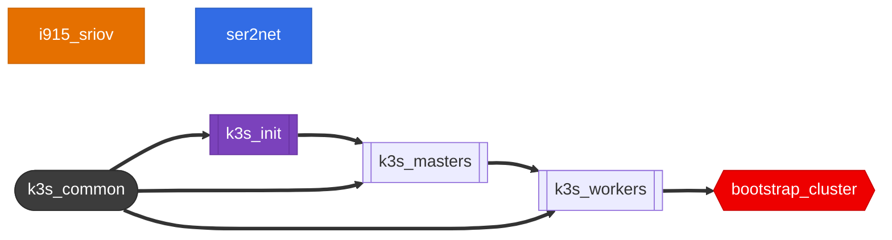
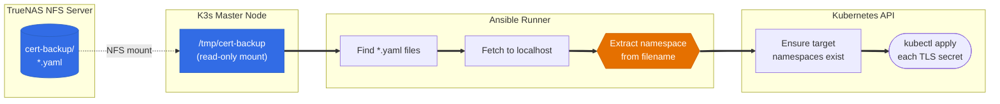
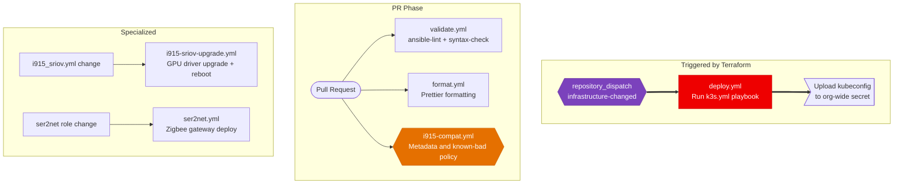
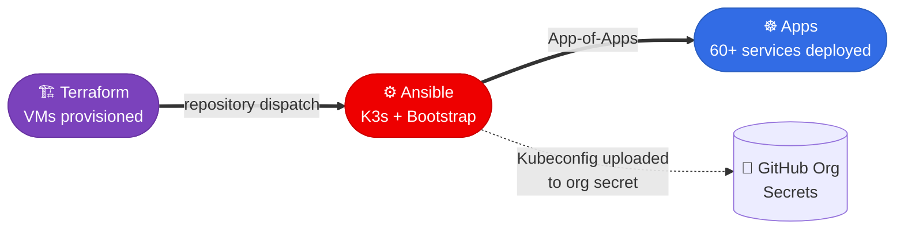

<div align="center">

# ⚙️ Ansible — Cluster Configuration

**Zero-touch K3s provisioning with HA, GPU virtualization, and GitOps bootstrap**

[](https://www.ansible.com/)
[](https://k3s.io/)
[](https://kubernetes.io/)
[](https://www.python.org/)

*Transforms bare Debian VMs into a production-grade Kubernetes cluster with a single playbook run*

</div>

---

## Table of Contents

- [Overview](#overview)
- [Deployment Pipeline](#deployment-pipeline)
- [Roles](#roles)
- [Inventory \& Discovery](#inventory--discovery)
- [Key Features](#key-features)
- [Additional Playbooks](#additional-playbooks)
- [CI/CD Automation](#cicd-automation)
- [Cross-Repo Integration](#cross-repo-integration)
- [Prerequisites](#prerequisites)
- [Usage](#usage)
- [License \& Contributing](#license--contributing)

---

## Overview

This repository takes freshly provisioned Debian VMs (from Terraform) and transforms them into a fully operational K3s Kubernetes cluster. The main `k3s.yml` playbook executes a 6-play pipeline that:

1. Waits for VMs to become reachable via SSH
2. Initializes the first control plane node with embedded etcd
3. Deploys **Kube-VIP** for a highly available virtual IP
4. Joins additional masters and workers to the cluster
5. Labels worker nodes with GPU capabilities
6. Bootstraps the cluster with **Sealed Secrets**, **TLS certificate recovery**, and **ArgoCD** with SSO

Beyond K3s, dedicated playbooks manage **Intel i915 SR-IOV GPU drivers** on the Proxmox host and a **ser2net bridge** for Zigbee home automation hardware.

---

## Deployment Pipeline

The main `k3s.yml` playbook orchestrates cluster creation through six sequential plays:

```mermaid
sequenceDiagram
    autonumber
    participant Runner as CI Runner
    participant M0 as Master-01
    participant M1 as Master-N
    participant W as Workers
    participant Cluster as K3s Cluster

    rect rgb(60, 60, 60)
    Note over Runner, W: Play 1 — Wait for SSH
    Runner->>M0: SSH probe (10s delay, 300s timeout)
    Runner->>M1: SSH probe
    Runner->>W: SSH probe
    end

    rect rgb(123, 66, 188)
    Note over M0: Play 2 — Initialize First Master
    Runner->>M0: Role: k3s_init
    M0->>M0: Install K3s (--cluster-init)
    M0->>M0: Deploy Kube-VIP DaemonSet
    M0->>M0: Advertise VIP (10.9.9.99)
    end

    rect rgb(50, 108, 229)
    Note over M0: Play 3 — Harvest Token
    M0-->>Runner: node-token
    Runner->>Runner: Set global fact
    Runner->>Cluster: Verify VIP responds (6443)
    end

    rect rgb(123, 66, 188)
    Note over M1: Play 4 — Join Additional Masters
    Runner->>M1: Role: k3s_masters
    M1->>Cluster: Join via VIP
    end

    rect rgb(50, 108, 229)
    Note over W: Play 5 — Join Workers
    Runner->>W: Role: k3s_workers
    W->>Cluster: Join as agents
    Runner->>Cluster: Label nodes (worker + GPU)
    end

    rect rgb(238, 0, 0)
    Note over Runner: Play 6 — Bootstrap
    Runner->>Cluster: Pre-seed Sealed Secrets key
    Runner->>Cluster: Mount NFS → Restore TLS certs
    Runner->>Cluster: Install ArgoCD (Helm + OIDC)
    Runner->>Cluster: Apply App-of-Apps bootstrap
    end
```



---

## Roles

Seven roles cover the full lifecycle from bare VM to GitOps-ready cluster:

| Role | Target | Purpose |
|------|--------|---------|
| **k3s_common** | All K3s nodes | Kernel tuning (inotify), Docker Hub auth, K3s binary download |
| **k3s_init** | First master | K3s `--cluster-init`, Kube-VIP DaemonSet, kubeconfig extraction |
| **k3s_masters** | Additional masters | Join control plane via VIP, wait for API readiness |
| **k3s_workers** | Worker nodes | Join as agents, apply `worker` + `gpu` node labels |
| **bootstrap_cluster** | CI runner (localhost) | Sealed Secrets key, TLS cert restore from NFS, ArgoCD + OIDC setup, App-of-Apps |
| **i915_sriov** | Proxmox host | Intel GPU SR-IOV driver lifecycle (install, upgrade, GRUB, sysfs VF config) |
| **ser2net** | Proxmox host | Expose USB Zigbee dongle as TCP socket for cluster consumption |

### Role Execution Order

The diagram below shows the order in which roles run across the `k3s.yml` plays. This sequence is enforced by the playbook's play order — only `k3s_common` is declared as an actual role `meta` dependency; the rest run in sequence because each play targets the next set of hosts.



---

## Inventory & Discovery

### Dynamic Inventory (Proxmox API)

VMs are discovered automatically via the `community.proxmox.proxmox` inventory plugin, using **Proxmox tags** set by Terraform:

| Ansible Group | Tag Filter | Description |
|--------------|------------|-------------|
| `all_k3s` | `k3s` | All Kubernetes nodes |
| `masters` | `k3s` + `master` | Control plane nodes |
| `workers` | `k3s` + `worker` | Worker nodes (GPU-labeled) |

IP addresses are extracted from cloud-init configuration (`proxmox_ipconfig0`), eliminating any hardcoded host lists.

### Static Inventory

The Proxmox hypervisor itself is in a static inventory for host-level operations (GPU drivers, ser2net):

```yaml
proxmox_hosts:
  hosts:
    pve:
      ansible_host: 10.9.9.20
      ansible_user: root
```

---

## Key Features

### High Availability — Kube-VIP

The cluster API is fronted by a **virtual IP (10.9.9.99)** managed by Kube-VIP running as a DaemonSet on control plane nodes. ARP-based leader election ensures seamless failover — all clients and workers connect through the VIP, never directly to a master node.

### Intel i915 SR-IOV — GPU Virtualization

The `i915_sriov` role manages the full GPU driver lifecycle on the Proxmox host:

- **Metadata and known-bad policy gate** — before anything destructive, `scripts/i915_compat.py` rejects reproduced runtime regressions and checks the exact release's declared kernel support; blocked, unknown or unsupported combinations abort with the host untouched. This does not test hardware
- **DKMS driver** install/upgrade from GitHub releases
- **Kernel pinning** — `i915_sriov_pinned_kernel` (e.g. `6.17.13-13-pve`) is the authoritative desired host kernel; the role builds and verifies the DKMS module for it *before* pinning it via `proxmox-boot-tool` and rebooting into it
- **GRUB parameters**: `intel_iommu=on i915.enable_guc=3 i915.max_vfs=7 module_blacklist=xe`
- **sysfs configuration** to create 7 virtual functions on boot

#### Host and guest driver versions differ on purpose

The Proxmox host (PF) and the Packer VM images (VF) run **different**
`i915-sriov-dkms` releases, because upstream maintains parallel lines and
states the two sides need not match:

| Side | Kernel | Driver | Upstream range |
|------|--------|--------|----------------|
| **Host** (this repo) | 6.17.13-13-pve | `2026.09.14` | 6.17 – 7.2 |
| **Guest** (packer repo) | 6.12 (Debian 13) | `2026.03.05.7` | 6.12 – 6.19 |

Three axes are validated, all from upstream data for the exact tags — never
from version ordering, equality or a curated allowlist:

1. host driver ↔ host kernel (release notes of the tag)
2. guest driver ↔ guest kernel (release notes of the tag)
3. PF ↔ VF IOV ABI — `IOV_VERSION_{BASE,LATEST}_{MAJOR,MINOR}` from each tag's
   `gt/iov/abi/iov_version_abi.h`, replayed through the upstream handshake

`scripts/i915_compat.py` (stdlib only, shared verbatim with the packer repo)
implements this and **fails closed**: a missing tag, unparsable release notes,
a missing ABI header or a network failure all exit non-zero instead of
passing an unverified metadata combination. The independent local exclusion
for host release `2026.09.16` rejects the reproduced runtime regression even
though its declared kernel/ABI metadata agrees. This is a small deny list of
observed failures, not a host/guest compatibility allowlist.

```bash
python3 scripts/i915_compat.py \
  --host-version 2026.09.14 --host-kernel 6.17.13-13-pve \
  --guest-version 2026.03.05.7 --guest-kernel 6.12
# exit 0 = metadata/policy passed, hardware NOT TESTED
# exit 1 = unsupported or blocked · 2 = metadata cannot be established
```

Renovate is free to propose newer host releases, but the `i915-compat`
workflow re-runs the same check against the pinned kernel (and the guest state
on the packer repo's `main`) and fails with a sticky report if metadata or
known-bad policy rejects it. Every report explicitly says hardware acceptance
was not tested. A green metadata check is not approval to call an upgrade
operationally verified. Moving the guest to a newer release line is a
packer-repo change; the host only needs a driver whose range covers
`i915_sriov_pinned_kernel`.

The required-check names are versioned in `.github/required-status-checks.json`.
After the named checks exist and pass, an authorized administrator can apply
that exact list without replacing other branch protections:

```sh
gh api --method PATCH \
  repos/Starktastic-Homelab/ansible/branches/main/protection/required_status_checks \
  --input .github/required-status-checks.json
```

#### Host-driver recovery and GPU acceptance

The host pin `2026.09.14` restored hardware encoding after the VA-API
initialization failures observed on both workers with `2026.09.16`.
Renovate excludes the bad release and disables automerge for host-driver
updates; the checker also rejects it in CI and before direct Ansible
installation. Later releases remain visible for manual review. Kernel/IOV
metadata alone does not prove usable hardware encoding.

**Merge only during an approved Proxmox maintenance window.** A push to
`main` changing `group_vars/proxmox_hosts/i915_sriov.yml` automatically runs
the upgrade workflow. The role schedules `sync && shutdown -r +1`, which
interrupts the hosted VMs and potentially the whole cluster, not just
Jellyfin. Confirm working console access and recoverable critical-workload
backups first. Do not issue a second manual reboot.

After the host returns, verify the running kernel and **loaded** module on
the Proxmox console, not just the installed package:

```sh
uname -r
cat /sys/module/i915/version
dkms status
proxmox-boot-tool kernel list
```

For this rollback, expect kernel `6.17.13-13-pve` and loaded module
`2026.09.14-sriov`. Keep the guest images, GPU device plugin, and application
encoding settings unchanged. Wait for the nodes and workloads to recover,
then confirm Jellyfin and Immich run on different workers with
`kubectl -n media get pods -o wide`.

Readiness and advertised GPU resources can remain healthy while encoding
is broken. Require exit zero from actual synthetic hardware encodes:

```sh
kubectl -n media exec deployment/jellyfin -c main -- \
  s6-setuidgid abc timeout 30 /usr/lib/jellyfin-ffmpeg/ffmpeg \
  -hide_banner -loglevel error \
  -init_hw_device vaapi=va:/dev/dri/renderD128 -filter_hw_device va \
  -f lavfi -i testsrc2=size=128x128:rate=30 -t 1 \
  -vf format=nv12,hwupload -c:v h264_vaapi -low_power 1 -f null -

kubectl -n media exec deployment/immich-main -- \
  timeout 30 ffmpeg -hide_banner -loglevel error \
  -init_hw_device vaapi=va:/dev/dri/renderD128 -filter_hw_device va \
  -f lavfi -i testsrc2=size=128x128:rate=30 -t 1 \
  -vf format=nv12,hwupload -c:v h264_vaapi -f null -
```

Repeat the Jellyfin command with `-c:v hevc_vaapi` to cover its other enabled
low-power encoder. Then verify a real forced hardware transcode, HDR tone
mapping, and seeking in Jellyfin, and inspect the new worker boots for GuC
CT errors. Direct play is not proof. If the rollback does not restore
encoding, stop and investigate before another driver/kernel change or
reboot. This recovery does not address the separate SQLite contention.

#### Reproducible runtime acceptance

`i915-acceptance.yml` reads the loaded kernel/module, boot ID and machine ID
over the existing infrastructure inventory. It then checks that Kubernetes
reports those same node identities and runs a short GPU Job on **every**
inventory worker. The jobs use a pinned diagnostic FFmpeg image as UID 1000,
request the existing `gpu.intel.com/i915` device-plugin resource, and mount no
application volumes. They do not depend on Jellyfin or Immich deployments.

Each worker must encode at least 30 frames through low-power H.264, low-power
HEVC, and synthetic HEVC Main10/PQ hardware decoding plus VA-API tone mapping
and hardware encoding. Exit zero without the required frame evidence is not
acceptance. Temporary namespaces/jobs and private kubeconfigs are cleaned in
nested `always` blocks; diagnostic artifacts contain no kubeconfig or SSH/Vault
credentials.

There are three explicit scopes:

| Mode | Meaning |
|------|---------|
| `capture` | Save pre-change identities and the intended target; no GPU probes, installation or reboot. The guest fleet must match its declared target before changing the host. |
| `current-stack` | Verify the declared target is actually loaded and run the GPU probes. Does **not** claim a reboot occurred or validate an uninstalled candidate. |
| `post-reboot` | Require the successful installation run's saved baseline, unchanged machine identities, changed boot IDs on the host and all cluster nodes, the frozen target's loaded versions, and every GPU probe. |

The installation workflow captures and uploads `i915-before` **before** changing
the host. Its successful conclusion means installation/reboot scheduling only.
The runner itself reboots with Proxmox, so runtime acceptance is a separate,
explicitly invoked workflow after recovery, not a wait inside installation.

Current-stack diagnostics can also be dispatched through the existing validation
workflow:

```sh
gh workflow run i915-compat.yml --repo Starktastic-Homelab/ansible \
  -f runtime_mode=current-stack
```

For post-upgrade acceptance, set `INSTALLATION_RUN_ID` to the successful
`i915-sriov-upgrade.yml` run that saved the baseline:

```sh
gh workflow run i915-acceptance.yml --repo Starktastic-Homelab/ansible \
  -f mode=post-reboot -f installation_run_id="$INSTALLATION_RUN_ID"
```

The workflow verifies the producer run and reuses its frozen target. An expired
or missing baseline is a failure, not permission to assume fresh boots. A
no-op installation that did not reboot can receive current-stack diagnostics,
not post-reboot acceptance. If an emergency prevents baseline capture, use a
separately approved recovery procedure and document that limitation rather than
manufacturing before/after evidence.

The diagnostic image is deliberately pinned independently of the application
catalog. These synthetic probes test the hardware paths, not visual quality,
application upgrades, seeking, or database/probe stability; retain the real
application-level playback acceptance above.

Offline guard tests, including stale boots, wrong loaded versions, missing
workers, command failures and zero-frame false positives:

```sh
python3 scripts/tests/test_i915_compat.py
python3 scripts/tests/test_i915_acceptance.py
```

### Sealed Secrets Bootstrap

The bootstrap role **pre-seeds the Sealed Secrets TLS keypair** before any workloads deploy. This enables a "secrets-in-git" workflow — encrypted SealedSecret manifests can be committed to the Apps repo and will decrypt correctly from day zero.

### ArgoCD with SSO

ArgoCD is deployed via Helm with:

- **Authentik OIDC integration** for single sign-on
- **Progressive syncs** enabled for phased rollout support
- **RBAC** with Authentik group mapping (Admins → admin role)
- **App-of-Apps bootstrap** pointing to the Apps repo, triggering full cluster reconciliation

### TLS Certificate Recovery

On cluster rebuild, TLS certificates are **recovered from NFS backup** rather than re-issued. This prevents Let's Encrypt rate limiting and ensures services come back online with valid certificates immediately. The restore process orchestrates data across three systems:



On a fresh cluster where no NFS backup exists yet, the restore step **gracefully skips** without failing — certificates will be issued fresh by cert-manager and backed up on the next CronJob run.

---

## Additional Playbooks

| Playbook | Target | Purpose |
|----------|--------|---------|
| `i915-sriov.yml` | Proxmox host | Install/upgrade Intel SR-IOV GPU driver |
| `ser2net.yml` | Proxmox host | Configure TCP bridge for USB Zigbee dongle (port 3333) |

---

## CI/CD Automation

Six workflows cover deployment, validation, and specialized hardware management:



| Workflow | Trigger | Purpose |
|----------|---------|---------|
| **deploy** | Terraform dispatch / push to main | Full K3s deployment + kubeconfig upload |
| **validate** | PR | `ansible-lint` (production profile) + syntax check |
| **format** | PR | Prettier YAML/JSON formatting |
| **i915-sriov-upgrade** | i915 config change / manual | GPU driver lifecycle on Proxmox host |
| **i915-compat** | PR (i915 config/role changes) | Blocks merge unless upstream data proves the host ↔ guest driver combination works |
| **ser2net** | ser2net role change / manual | Zigbee serial bridge configuration |

---

## Cross-Repo Integration

Ansible sits in the middle of the infrastructure pipeline, receiving triggers from Terraform and bootstrapping the Apps deployment:



The handoff chain:
1. **Terraform apply** completes → sends `infrastructure-changed` dispatch event
2. **Ansible deploy** workflow runs the `k3s.yml` playbook
3. **ArgoCD** is installed and pointed at the Apps repo via App-of-Apps
4. **Kubeconfig** is uploaded to the GitHub org secrets for use by the Apps CI workflows

---

## Prerequisites

- **Python** ≥ 3.11 with `ansible`, `proxmoxer`, `kubernetes` packages
- **Helm** (for ArgoCD deployment)
- **Network access** to Proxmox API and K3s node SSH
- **Ansible Vault** password file (`.vault_pass`) for encrypted secrets
- **Proxmox API token** for dynamic inventory

---

## Usage

```bash
# Install Python dependencies
pip install -r requirements.txt

# Deploy K3s cluster
ansible-playbook -i inventory/ k3s.yml

# Upgrade GPU driver on Proxmox host
ansible-playbook -i inventory/ i915-sriov.yml

# Configure Zigbee serial bridge
ansible-playbook -i inventory/ ser2net.yml
```

> In practice, the `k3s.yml` playbook is triggered automatically by the Terraform pipeline via GitHub Actions `repository_dispatch`.

---

## License & Contributing

This is a personal homelab project. Feel free to use it as inspiration for your own infrastructure. If you spot an issue or have a suggestion, [open an issue](../../issues) — contributions and feedback are welcome.

## External maintenance coordination

Storage maintenance, fencing and infrastructure replacement share VM300's
`/var/lib/homelab-maintenance`, mounted as `/maintenance` in mutating job
containers. An absent/mismatched runner marker blocks execution. The record is
independent of K3s and NAS availability; it survives job cancellation and reboot.
No age-based takeover or unconditional unlock exists. Prohibit concurrent manual
Proxmox GUI start/recreate operations during a maintenance operation.

Before merging workflows, run `maintenance-runner.yml` against an explicitly
reviewed `maintenance_runner` inventory host for **VM300**, after confirming its
address, SSH route, service user and SMBIOS UUID. Set `maintenance_runner_user`
to that service user. The role checks UUID
`cc1aeeb7-4827-466c-9d4b-5dc6c881f193`; it neither guesses an IP nor creates a
runner. Restart the runner service in an approved window if supplementary group
membership changed. This bootstrap is manual, never part of `k3s.yml`.

Deploy uses a pinned helper, acquires before configuration, verifies immediately
before the playbook, and releases only after success. Terraform's companion PR
holds the same lock through drain/apply/recovery and releases before dispatching
Ansible. Existing workflow concurrency alone does not serialize repositories.
The mutation job must run on this external runner; a container-local directory
without the matching host marker cannot acquire ownership.

After a failed/cancelled operation: inspect `operation.json` on VM300 (protect its
nonce from logs), identify the exact repository/run/attempt and current stage,
ensure the owner process is gone, inspect infrastructure/workload state, and
reconcile the failed operation explicitly. Never delete a lock just because it is
old. An operator continuation requires the original `MAINTENANCE_OWNER` and
`MAINTENANCE_NONCE`, the expected `HOMELAB_RUNNER_INSTANCE`, and an exact stage:

```sh
python3 scripts/maintenance_lock.py verify --stage acquired
python3 scripts/maintenance_lock.py advance --stage acquired --next-stage held
```

Use the recorded stage, not necessarily the example above. Only after resolving
all uncertain effects may the original owner release. Losing the runner disk or
its identity blocks maintenance until the shared lock domain is recovered and
all possible writers/infrastructure jobs have been reconciled. Do not provision
a second independent runner marker to bypass a held operation.
