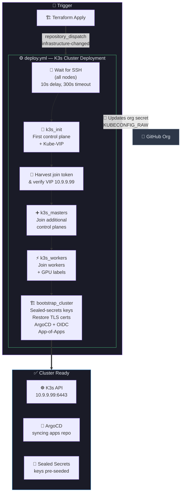
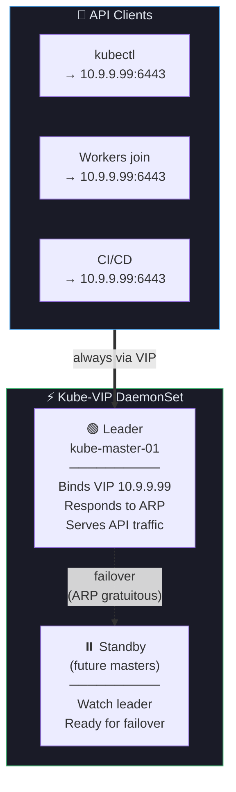
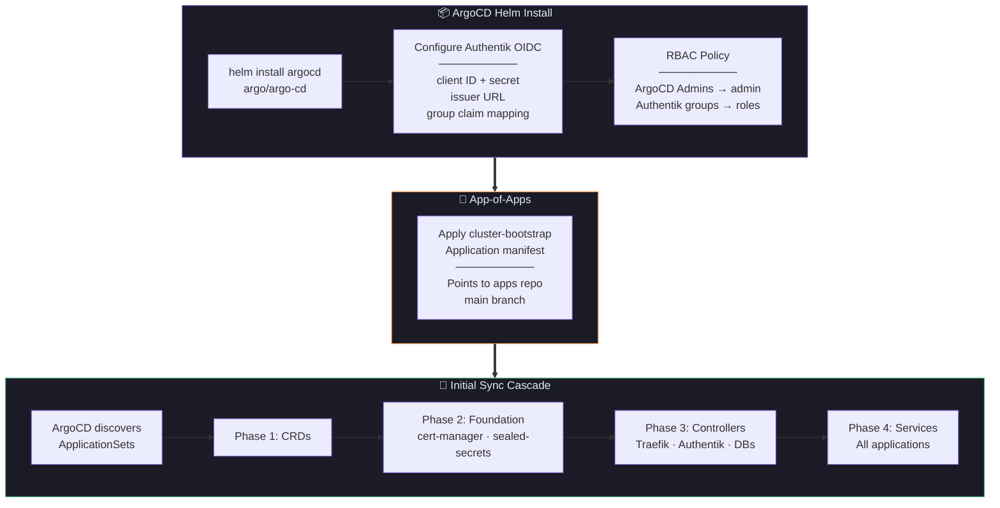
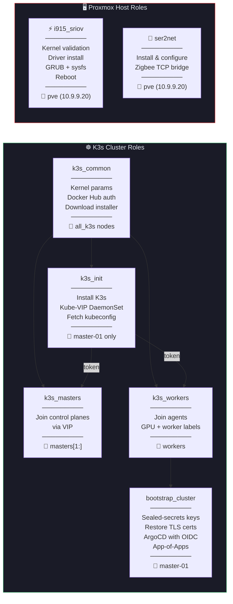
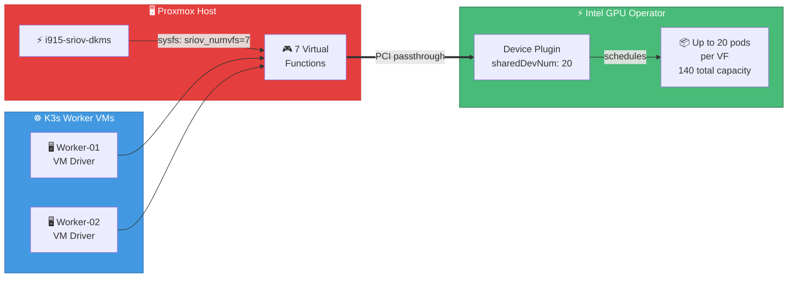
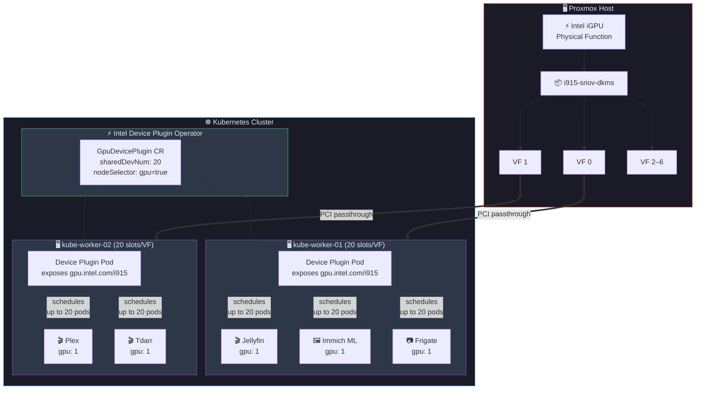

# Homelab Ansible

[](https://github.com/Starktastic-Homelab/ansible/actions/workflows/deploy.yml)
[](https://github.com/Starktastic-Homelab/ansible/actions/workflows/i915-sriov-upgrade.yml)


Ansible playbooks for deploying a K3s Kubernetes cluster with Kube-VIP HA, ArgoCD GitOps, Authentik SSO, and sealed-secrets — plus Intel SR-IOV GPU driver management on Proxmox hosts and a Zigbee serial gateway.

## Overview

This is the third stage of the [Starktastic Homelab](https://github.com/Starktastic-Homelab) pipeline. Triggered automatically by [Terraform](https://github.com/Starktastic-Homelab/terraform) after VMs are provisioned, it transforms bare Debian VMs into a fully bootstrapped K3s cluster — complete with a virtual IP for API server HA, pre-seeded sealed-secrets keys, restored TLS certificates from NFS backup, and ArgoCD installed with Authentik OIDC single sign-on. It also manages Intel SR-IOV GPU drivers on the Proxmox hypervisor and a ser2net Zigbee bridge.



## Features

- **Multi-Stage K3s Deployment** — Init → token harvest → VIP verification → join masters → join workers → bootstrap
- **Kube-VIP HA** — ARP-based virtual IP (`10.9.9.99`) for API server high availability with leader election
- **ArgoCD + OIDC** — GitOps controller with Authentik SSO, group-based RBAC, and App-of-Apps bootstrap
- **Sealed Secrets** — Pre-seeded TLS keys so encrypted secrets in the apps repo decrypt correctly from day one
- **TLS Certificate Restore** — Mounts NFS backup and restores Let's Encrypt certificates to avoid re-issuance
- **Intel SR-IOV** — Manages GPU driver lifecycle on Proxmox hosts with kernel validation and coordinated reboots
- **Zigbee Gateway** — ser2net role exposes USB Zigbee dongle as TCP socket for remote access
- **Dynamic Inventory** — Auto-discovers K3s nodes via Proxmox VM tags (`k3s`, `master`, `worker`)
- **Kubeconfig Handoff** — Uploads cluster kubeconfig as an org-level GitHub secret for downstream CI/CD
- **Renovate Managed** — K3s, Kube-VIP, ArgoCD chart, and SR-IOV driver versions auto-updated

## Repository Structure

```
ansible/
├── k3s.yml                    # Main playbook — full cluster deployment
├── i915-sriov.yml             # Intel SR-IOV driver upgrade on Proxmox host
├── ser2net.yml                # Zigbee serial-to-network bridge on Proxmox host
├── ansible.cfg                # Config — vault password file path
├── requirements.txt           # Python deps (ansible, proxmoxer, kubernetes)
├── inventory/
│   ├── proxmox.yml            # Dynamic inventory — discovers VMs by tag
│   └── hosts.yml              # Static inventory — Proxmox hypervisor
├── group_vars/
│   ├── all/
│   │   ├── vars.yml           # Cluster config (VIP, domains, NFS, k3s version)
│   │   └── secrets.yml        # Vault-encrypted secrets (sealed-secrets, OIDC, Docker Hub)
│   └── proxmox_hosts/
│       ├── vars.yml           # Proxmox host credentials
│       └── i915_sriov.yml     # SR-IOV driver version (Renovate-managed)
└── roles/
    ├── k3s_common/            # Shared setup — kernel params, registries, install script
    ├── k3s_init/              # First master — K3s init + Kube-VIP + kubeconfig
    ├── k3s_masters/           # Additional masters — join via VIP
    ├── k3s_workers/           # Workers — join + label (worker, gpu)
    ├── bootstrap_cluster/     # Post-cluster — sealed-secrets, certs, ArgoCD, App-of-Apps
    ├── i915_sriov/            # GPU driver — validate, install, GRUB, sysfs, reboot
    └── ser2net/               # Zigbee bridge — install, configure, start service
```

## Playbooks

### `k3s.yml` — Cluster Deployment

The main playbook executes six plays in sequence:

```mermaid
sequenceDiagram
    participant TF as 🏗️ Terraform
    participant GH as 🔄 GitHub Actions
    participant M1 as 🖥️ Master-01
    participant Mn as Masters[1:]
    participant W as ⚡ Workers
    participant K8s as ☸️ Cluster

    rect rgb(26,27,39)
    Note over TF,GH: Trigger
    TF->>GH: repository_dispatch
    end

    rect rgb(26,27,39)
    Note over GH,M1: Phase 1 — Init
    GH->>M1: Wait for SSH (10s delay, 300s timeout)
    GH->>M1: k3s_init — install K3s (--cluster-init)
    Note right of M1: --flannel-iface eth1
    Note right of M1: --disable traefik,servicelb
    Note right of M1: --tls-san 10.9.9.99
    M1->>M1: Deploy Kube-VIP DaemonSet (ARP, VIP 10.9.9.99)
    M1-->>GH: /var/lib/rancher/k3s/server/node-token
    GH->>GH: Verify VIP responds at 10.9.9.99:6443
    end

    rect rgb(26,27,39)
    Note over GH,W: Phase 2 — Join
    GH->>Mn: k3s_masters — join via VIP (--server https://10.9.9.99:6443)
    GH->>W: k3s_workers — join as agents
    W->>W: Label: node-role.kubernetes.io/worker
    W->>W: Label: intel.feature.node.kubernetes.io/gpu
    end

    rect rgb(26,27,39)
    Note over GH,K8s: Phase 3 — Bootstrap
    GH->>K8s: 🔑 Pre-seed sealed-secrets TLS key
    GH->>K8s: 📜 Mount NFS & restore TLS certificates
    GH->>K8s: 🔄 Install ArgoCD (Helm) with Authentik OIDC
    GH->>K8s: 🚀 Apply App-of-Apps bootstrap Application
    K8s-->>GH: Cluster fully operational
    end

    GH->>GH: 🔑 Upload kubeconfig → org secret KUBECONFIG_RAW
```



**K3s configuration highlights:**
- `--cluster-init` — Embedded etcd for HA-ready control plane
- `--flannel-iface eth1` — Pod traffic on the services network
- `--disable traefik --disable servicelb` — Replaced by dedicated Traefik + MetalLB in apps repo
- `--tls-san 10.9.9.99` — VIP included in API server certificate

### `i915-sriov.yml` — GPU Driver Upgrade

Targets the Proxmox hypervisor to manage the Intel SR-IOV DKMS driver:

1. Validates kernel version is in supported range (6.12 – 6.19)
2. Compares installed vs target driver version
3. Downloads and installs the new `.deb` package
4. Ensures GRUB params: `intel_iommu=on i915.enable_guc=3 i915.max_vfs=7 module_blacklist=xe`
5. Configures sysfsutils to create 7 virtual functions on boot
6. Schedules a delayed reboot (60s) to allow the CI workflow to complete

### `ser2net.yml` — Zigbee Gateway

Installs and configures ser2net on the Proxmox host, exposing a USB Zigbee dongle (Sonoff Zigbee 3.0 USB Dongle Plus V2) as a TCP socket on port `3333` — consumed by Zigbee2MQTT running inside the cluster at `10.9.9.20:3333`.

### Kube-VIP High Availability

Kube-VIP runs as a DaemonSet on control plane nodes, using ARP-based leader election to manage a floating virtual IP for the K3s API server:



### Certificate Restore Flow

During cluster bootstrap, TLS certificates backed up to NFS are restored to avoid Let's Encrypt re-issuance delays:

```mermaid
sequenceDiagram
    participant Ansible as ⚙️ Ansible
    participant NFS as 💾 NFS · 10.9.8.30
    participant K8s as ☸️ Kubernetes

    rect rgb(26,27,39)
    Note over Ansible,K8s: 📜 TLS Certificate Restore
    Ansible->>NFS: Mount /mnt/apps/pv/cert-backup
    Ansible->>Ansible: Discover backed-up TLS secrets<br/>(filter kubernetes.io/tls type)
    loop For each certificate
        Ansible->>K8s: Create namespace if missing
        Ansible->>K8s: Apply Secret (tls.crt + tls.key)<br/>with cert-manager annotations
    end
    Ansible->>NFS: Unmount backup
    Note over K8s: ✅ All certs available instantly<br/>No Let's Encrypt re-issuance needed
    end
```



### ArgoCD Bootstrap Detail

The final bootstrap step installs ArgoCD with Authentik OIDC SSO and creates the App-of-Apps that triggers the full cluster sync:



## Roles



| Role | Description |
|------|-------------|
| **k3s_common** | Sets kernel params (`inotify`), deploys Docker Hub registry auth, downloads K3s install script |
| **k3s_init** | Installs K3s with `--cluster-init`, deploys Kube-VIP DaemonSet via containerd, fetches kubeconfig |
| **k3s_masters** | Joins additional control plane nodes to the cluster via the VIP |
| **k3s_workers** | Joins worker nodes as agents, labels them with `worker` and `gpu` roles |
| **bootstrap_cluster** | Pre-seeds sealed-secrets key, restores TLS certs from NFS, installs ArgoCD with OIDC, applies the App-of-Apps |
| **i915_sriov** | Validates kernel compatibility, installs/upgrades SR-IOV DKMS driver, configures GRUB and sysfs, reboots |
| **ser2net** | Installs ser2net, deploys config template, enables systemd service |

## Dynamic Inventory

The `community.proxmox.proxmox` inventory plugin discovers K3s VMs by their Proxmox tags and extracts IP addresses from cloud-init config:

| Ansible Group | Required Tags | Description |
|---------------|---------------|-------------|
| `all_k3s` | `k3s` | All Kubernetes nodes |
| `masters` | `k3s` + `master` | Control plane nodes |
| `workers` | `k3s` + `worker` | Worker nodes |

The static `hosts.yml` defines the Proxmox hypervisor itself (`pve` at `10.9.9.20`) for the SR-IOV and ser2net playbooks.

## Configuration

### Key Variables (`group_vars/all/vars.yml`)

| Variable | Value | Description |
|----------|-------|-------------|
| `vip_address` | `10.9.9.99` | Virtual IP for K3s API server (Kube-VIP) |
| `mgmt_iface` | `eth0` | Management NIC (Kube-VIP binding) |
| `flannel_iface` | `eth1` | Services NIC (Flannel CNI overlay) |
| `base_domain` | `starktastic.net` | Base domain for all services |
| `internal_domain` | `internal.starktastic.net` | Internal-only services domain |
| `argocd_url` | `https://argocd.internal.starktastic.net` | ArgoCD dashboard URL |
| `authentik_url` | `https://auth.starktastic.net` | Authentik SSO issuer |
| `nfs_server` | `10.9.8.30` | TrueNAS NFS server |
| `k3s_version` | Renovate-managed | K3s release (pinned, auto-updated) |

### Encrypted Secrets (`group_vars/all/secrets.yml`)

Vault-encrypted file containing:

- **Sealed-secrets** TLS key and certificate (base64)
- **ArgoCD** admin password hash
- **ArgoCD** OIDC client ID and secret (Authentik)
- **Docker Hub** username and token (registry auth)

## CI/CD

| Workflow | Trigger | Description |
|----------|---------|-------------|
| **deploy.yml** | `repository_dispatch` from Terraform, push to `main`, or manual | Runs `k3s.yml` → uploads kubeconfig → updates org secret |
| **i915-sriov-upgrade.yml** | Push modifying `i915_sriov.yml`, or manual with version override | Runs `i915-sriov.yml` on Proxmox host |
| **ser2net.yml** | Push modifying ser2net role files, or manual | Runs `ser2net.yml` on Proxmox host |
| **validate.yml** | Pull requests | Ansible-lint + syntax check |
| **format.yml** | Pull requests | Code formatting check |

### Required Secrets

| Secret | Purpose |
|--------|---------|
| `SSH_PRIVATE_KEY` | SSH access to VMs and Proxmox host |
| `ANSIBLE_VAULT_PASSWORD` | Decrypts `secrets.yml` |
| `PROXMOX_API_URL` / `PROXMOX_API_TOKEN_*` | Dynamic inventory via Proxmox API |
| `GH_PAT_ORG_SECRET_MANAGER` | Updates org-level `KUBECONFIG_RAW` secret |

## Intel SR-IOV Driver Coordination

The i915 SR-IOV driver version must match between the Proxmox host (creates virtual functions) and the VM template (consumes them). Renovate opens PRs in both Ansible and Packer repos simultaneously.



**Merge order**: Ansible PR first (upgrades host, reboots) → Packer PR second (builds matching VM template). The Packer repo's `check-host-driver.yml` workflow blocks merge until the host is updated.

### GPU Virtual Function Runtime Model

Once SR-IOV is configured, the Intel GPU Operator manages how pods share the physical GPU at runtime. Each virtual function can be shared across up to 20 pods simultaneously — enabling hardware-accelerated transcoding, inference, and compute workloads without dedicated GPU assignment.



Pods request GPU access with a single resource field — the scheduler and device plugin handle the rest:

```yaml
resources:
  limits:
    gpu.intel.com/i915: 1    # Allocated a shared slice of a VF
```

| Layer | Component | Configuration |
|-------|-----------|---------------|
| **Host** | GRUB | `intel_iommu=on i915.enable_guc=3 i915.max_vfs=7 module_blacklist=xe` |
| **Host** | sysfs | `sriov_numvfs = 7` (created on boot) |
| **VM** | Proxmox | PCI passthrough of VF to each worker |
| **K8s** | Node label | `intel.feature.node.kubernetes.io/gpu: "true"` |
| **K8s** | Device Plugin | `sharedDevNum: 20` — 20 pods per VF, 140 total capacity |

## Usage

```bash
# Install Python dependencies
pip install -r requirements.txt

# Deploy full cluster
ansible-playbook k3s.yml

# Target specific phases
ansible-playbook k3s.yml --tags init          # First master only
ansible-playbook k3s.yml --tags workers       # Worker nodes only
ansible-playbook k3s.yml --tags bootstrap     # ArgoCD + secrets only
ansible-playbook k3s.yml --tags argocd        # ArgoCD reinstall only

# Upgrade SR-IOV driver on Proxmox host
ansible-playbook i915-sriov.yml

# Deploy Zigbee bridge
ansible-playbook ser2net.yml

# Development
ansible-playbook --syntax-check k3s.yml
ansible-playbook k3s.yml --check              # Dry run
ansible-playbook k3s.yml --limit masters -vvv # Verbose, specific hosts
```

## Troubleshooting

| Issue | Solution |
|-------|----------|
| SSH connection timeout | Verify VMs are running and cloud-init has completed; check Proxmox firewall |
| K3s install fails | Inspect `/var/log/k3s-install.log` on the target node |
| Kube-VIP not responding | Verify VIP subnet matches `mgmt_iface`, check ARP responses with `arping` |
| ArgoCD OIDC login fails | Verify Authentik client credentials in vault; check issuer URL reachable |
| Sealed-secrets decryption error | Re-seed the key: `ansible-playbook k3s.yml --tags sealed-secrets` |
| SR-IOV kernel incompatible | Upgrade or pin the Proxmox kernel within the supported range (6.12–6.19) |
| ser2net connection refused | Verify USB device path; check `systemctl status ser2net` on host |

## Related Repositories

| Repository | Role in Pipeline |
|------------|-----------------|
| [packer](https://github.com/Starktastic-Homelab/packer) | Builds the VM template with matching SR-IOV driver |
| [terraform](https://github.com/Starktastic-Homelab/terraform) | Provisions VMs and triggers this repo via dispatch |
| [apps](https://github.com/Starktastic-Homelab/apps) | GitOps definitions synced by the ArgoCD instance this repo installs |

## License

MIT
