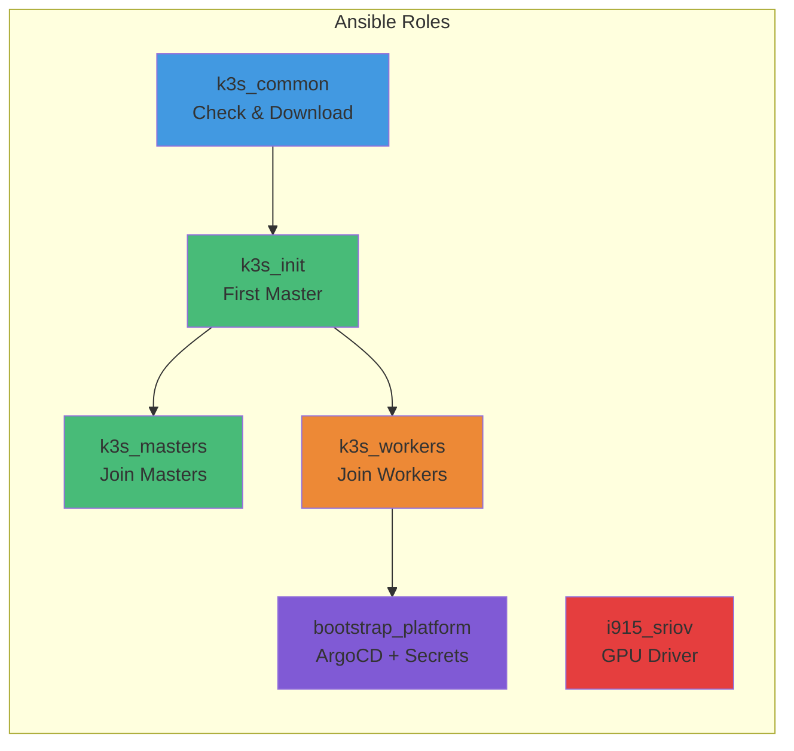
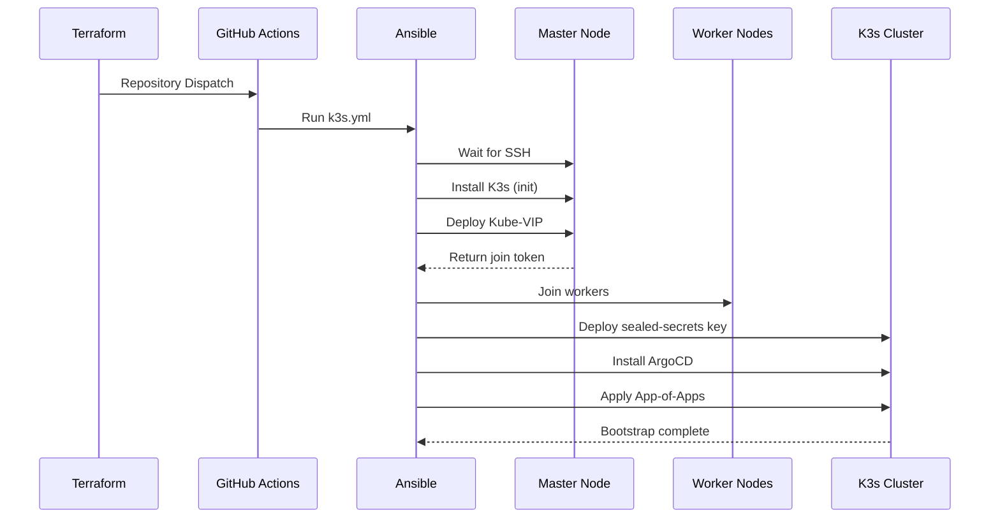
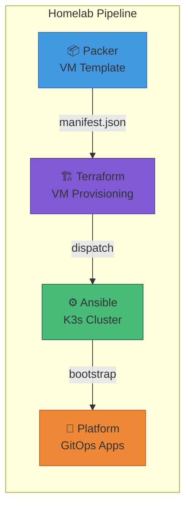

# Homelab Ansible

[](https://github.com/starktastic/homelab-ansible/actions/workflows/k3s.yml)
[](https://github.com/starktastic/homelab-ansible/actions/workflows/i915-sriov.yml)


Ansible playbooks for provisioning and managing a K3s Kubernetes cluster on Proxmox VMs, including Intel SR-IOV GPU driver management for the Proxmox host.

## Overview

This repository configures K3s Kubernetes on VMs provisioned by [homelab-terraform](https://github.com/starktastic/homelab-terraform) and bootstraps the GitOps platform with ArgoCD and sealed-secrets. It also manages Intel SR-IOV GPU drivers on Proxmox hosts.

```mermaid
flowchart TB
    subgraph Dispatch["Repository Dispatch"]
        Terraform[Terraform Apply] -->|triggers| Ansible
    end
    
    subgraph Ansible["Ansible Playbook"]
        Wait[Wait for SSH] --> Init[k3s_init]
        Init --> Token[Harvest Token]
        Token --> Masters[k3s_masters]
        Masters --> Workers[k3s_workers]
        Workers --> Bootstrap[bootstrap_platform]
    end
    
    subgraph Cluster["K3s Cluster"]
        API[API Server<br/>VIP: 10.9.9.99]
        ArgoCD[ArgoCD]
        Secrets[Sealed Secrets]
    end
    
    Bootstrap --> Cluster
    
    style Dispatch fill:#805ad5,stroke:#553c9a
    style Ansible fill:#2d3748,stroke:#48bb78
    style Cluster fill:#2d3748,stroke:#4299e1
```



## Features

- 🚀 **K3s Cluster Deployment** - Automated multi-node K3s installation
- ⚡ **Kube-VIP** - API server high availability with virtual IP
- 🔐 **ArgoCD + OIDC** - GitOps with Authentik SSO integration
- 🔑 **Sealed Secrets** - Pre-seeded encryption keys for GitOps secrets
- 🎮 **Intel SR-IOV** - GPU driver management on Proxmox hosts
- 📦 **Dynamic Inventory** - Auto-discovers nodes via Proxmox tags
- 🔄 **Renovate Managed** - Automated K3s and Kube-VIP version updates

## Repository Structure

```
homelab-ansible/
├── k3s.yml                 # Main K3s cluster playbook
├── i915-sriov.yml          # Intel SR-IOV driver upgrade playbook
├── ansible.cfg             # Ansible configuration
├── requirements.txt        # Python dependencies
├── inventory/
│   ├── proxmox.yml         # Dynamic inventory (Proxmox plugin)
│   └── hosts.yml           # Static inventory (Proxmox host)
├── group_vars/
│   ├── all/
│   │   ├── vars.yml        # Common variables
│   │   └── secrets.yml     # Vault-encrypted secrets
│   └── proxmox_hosts/
│       ├── vars.yml        # Proxmox host variables
│       └── i915_sriov.yml  # SR-IOV driver config
└── roles/
    ├── k3s_common/         # Shared K3s tasks
    ├── k3s_init/           # First control plane node
    ├── k3s_masters/        # Additional control plane nodes
    ├── k3s_workers/        # Worker node configuration
    ├── bootstrap_platform/ # ArgoCD + sealed-secrets
    └── i915_sriov/         # Intel GPU driver management
```

## Prerequisites

- Python 3.10+
- Ansible 13.x (`pip install -r requirements.txt`)
- Proxmox VE with VMs tagged appropriately (`k3s`, `master`, `worker`)
- Vault password file at `.vault_password` (not committed to git)

## Configuration

### Key Variables

| Variable | Value | Description |
|----------|-------|-------------|
| `vip_address` | `10.9.9.99` | Virtual IP for K3s API server |
| `flannel_iface` | `eth1` | Network interface for Flannel CNI |
| `base_domain` | `starktastic.net` | Base domain for services |
| `argocd_url` | `https://argocd.internal.starktastic.net` | ArgoCD dashboard URL |
| `authentik_url` | `https://auth.starktastic.net` | Authentik SSO URL |
| `k3s_version` | `v1.35.0+k3s3` | K3s version (Renovate managed) |
| `kubevip_version` | `v1.0.4` | Kube-VIP version (Renovate managed) |
| `argocd_chart_version` | `9.4.0` | ArgoCD Helm chart version |

### Encrypted Secrets

The `group_vars/all/secrets.yml` file contains (vault-encrypted):

- Sealed-secrets TLS key and certificate
- ArgoCD admin password hash
- ArgoCD OIDC client credentials for Authentik

## Roles



| Role | Description |
|------|-------------|
| `k3s_common` | Checks K3s installation status, downloads install script |
| `k3s_init` | Initializes first control plane, deploys Kube-VIP, fetches kubeconfig |
| `k3s_masters` | Joins additional control plane nodes to cluster |
| `k3s_workers` | Joins worker nodes, applies GPU and worker labels |
| `bootstrap_platform` | Deploys Kube-VIP config, sealed-secrets keys, ArgoCD with OIDC |
| `i915_sriov` | Upgrades Intel SR-IOV DKMS driver with kernel compatibility checks |

## Usage

### Quick Start

```bash
# Install dependencies
pip install -r requirements.txt

# Run the full playbook
ansible-playbook k3s.yml

# Run with specific tags
ansible-playbook k3s.yml --tags k3s           # K3s installation only
ansible-playbook k3s.yml --tags bootstrap     # Platform bootstrap only
ansible-playbook k3s.yml --tags workers       # Worker nodes only
```

### Available Tags

| Tag | Scope |
|-----|-------|
| `k3s` | All K3s-related tasks |
| `init` | First master initialization |
| `masters` | Additional master nodes |
| `workers` | Worker nodes |
| `kube-vip` | Kube-VIP deployment |
| `kubeconfig` | Kubeconfig setup |
| `bootstrap` | Platform bootstrapping |
| `argocd` | ArgoCD installation |
| `sealed-secrets` | Sealed-secrets key seeding |

### Intel SR-IOV Driver Upgrade

```bash
# Upgrade SR-IOV driver on Proxmox host
ansible-playbook i915-sriov.yml
```

## Dynamic Inventory

Uses `community.proxmox.proxmox` plugin to discover VMs by Proxmox tags:

| Group | Tags Required | Description |
|-------|---------------|-------------|
| `all_k3s` | `k3s` | All K3s nodes |
| `masters` | `k3s` + `master` | Control plane nodes |
| `workers` | `k3s` + `worker` | Worker nodes |

## Playbook Flow



## Development

```bash
# Syntax check
ansible-playbook --syntax-check k3s.yml

# Dry run
ansible-playbook k3s.yml --check

# Limit to specific hosts
ansible-playbook k3s.yml --limit masters

# Verbose output
ansible-playbook k3s.yml -vvv
```

## Pipeline Integration



## Troubleshooting

| Issue | Solution |
|-------|----------|
| SSH connection timeout | Verify VMs are running, check Proxmox firewall |
| K3s install fails | Check `/var/log/k3s-install.log` on target node |
| Kube-VIP not responding | Verify VIP is on same subnet, check ARP mode |
| ArgoCD OIDC fails | Verify Authentik client credentials in vault |
| Sealed-secrets mismatch | Re-seed key with `--tags sealed-secrets` |

## Related Repositories

| Repository | Description |
|------------|-------------|
| [homelab-packer](https://github.com/starktastic/homelab-packer) | Builds VM templates |
| [homelab-terraform](https://github.com/starktastic/homelab-terraform) | Provisions VMs on Proxmox |
| [homelab-platform](https://github.com/starktastic/homelab-platform) | GitOps application definitions |

## License

MIT
