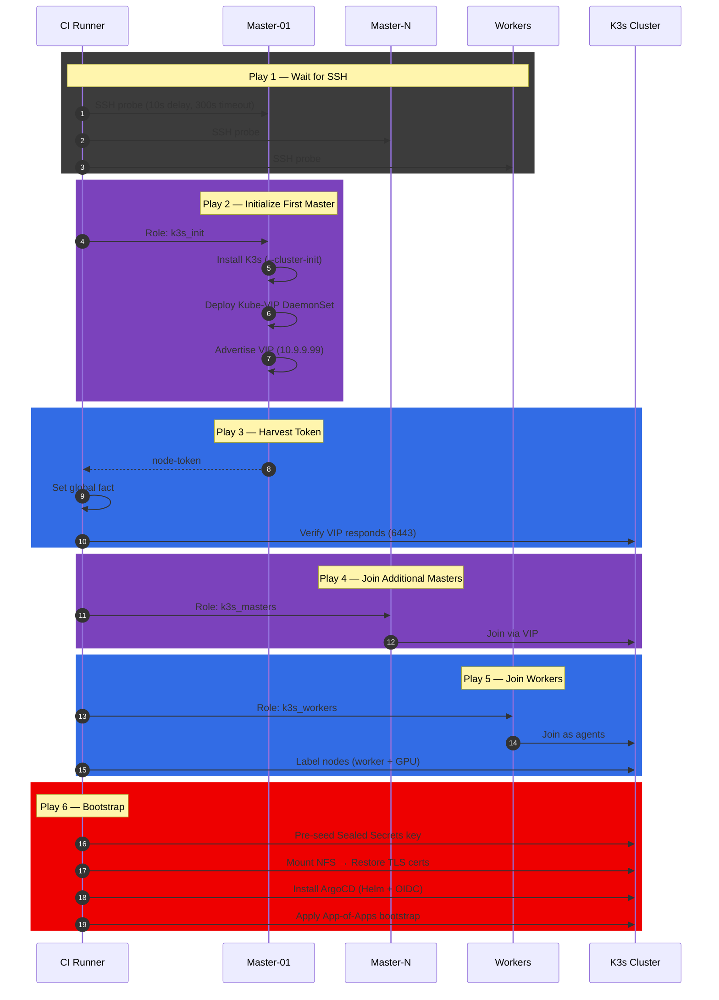
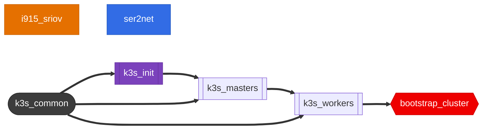
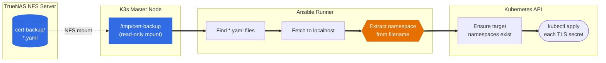
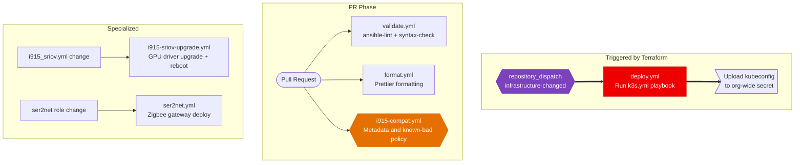
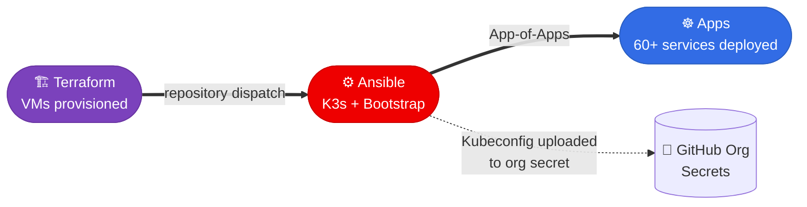

<div align="center">

# ⚙️ Ansible — Cluster Configuration

**Zero-touch K3s provisioning with HA, GPU virtualization, and GitOps bootstrap**

[](https://www.ansible.com/)
[](https://k3s.io/)
[](https://kubernetes.io/)
[](https://www.python.org/)

*Transforms bare Debian VMs into a production-grade Kubernetes cluster with a single playbook run*

</div>

---

## Table of Contents

- [Overview](#overview)
- [Deployment Pipeline](#deployment-pipeline)
- [Roles](#roles)
- [Inventory \& Discovery](#inventory--discovery)
- [Key Features](#key-features)
- [Additional Playbooks](#additional-playbooks)
- [CI/CD Automation](#cicd-automation)
- [Cross-Repo Integration](#cross-repo-integration)
- [Prerequisites](#prerequisites)
- [Usage](#usage)
- [License \& Contributing](#license--contributing)

---

## Overview

This repository takes freshly provisioned Debian VMs (from Terraform) and transforms them into a fully operational K3s Kubernetes cluster. The main `k3s.yml` playbook executes a 6-play pipeline that:

1. Waits for VMs to become reachable via SSH
2. Initializes the first control plane node with embedded etcd
3. Deploys **Kube-VIP** for a highly available virtual IP
4. Joins additional masters and workers to the cluster
5. Labels worker nodes with GPU capabilities
6. Bootstraps the cluster with **Sealed Secrets**, **TLS certificate recovery**, and **ArgoCD** with SSO

Beyond K3s, dedicated playbooks manage **Intel i915 SR-IOV GPU drivers** on the Proxmox host and a **ser2net bridge** for Zigbee home automation hardware.

---

## Deployment Pipeline

The main `k3s.yml` playbook orchestrates cluster creation through six sequential plays:


```mermaid
sequenceDiagram
    autonumber
    participant Runner as CI Runner
    participant M0 as Master-01
    participant M1 as Master-N
    participant W as Workers
    participant Cluster as K3s Cluster

    rect rgb(60, 60, 60)
    Note over Runner, W: Play 1 — Wait for SSH
    Runner->>M0: SSH probe (10s delay, 300s timeout)
    Runner->>M1: SSH probe
    Runner->>W: SSH probe
    end

    rect rgb(123, 66, 188)
    Note over M0: Play 2 — Initialize First Master
    Runner->>M0: Role: k3s_init
    M0->>M0: Install K3s (--cluster-init)
    M0->>M0: Deploy Kube-VIP DaemonSet
    M0->>M0: Advertise VIP (10.9.9.99)
    end

    rect rgb(50, 108, 229)
    Note over M0: Play 3 — Harvest Token
    M0-->>Runner: node-token
    Runner->>Runner: Set global fact
    Runner->>Cluster: Verify VIP responds (6443)
    end

    rect rgb(123, 66, 188)
    Note over M1: Play 4 — Join Additional Masters
    Runner->>M1: Role: k3s_masters
    M1->>Cluster: Join via VIP
    end

    rect rgb(50, 108, 229)
    Note over W: Play 5 — Join Workers
    Runner->>W: Role: k3s_workers
    W->>Cluster: Join as agents
    Runner->>Cluster: Label nodes (worker + GPU)
    end

    rect rgb(238, 0, 0)
    Note over Runner: Play 6 — Bootstrap
    Runner->>Cluster: Pre-seed Sealed Secrets key
    Runner->>Cluster: Mount NFS → Restore TLS certs
    Runner->>Cluster: Install ArgoCD (Helm + OIDC)
    Runner->>Cluster: Apply App-of-Apps bootstrap
    end
```

---

## Roles

Seven roles cover the full lifecycle from bare VM to GitOps-ready cluster:

| Role | Target | Purpose |
|------|--------|---------|
| **k3s_common** | All K3s nodes | Kernel tuning (inotify), Docker Hub auth, K3s binary download |
| **k3s_init** | First master | K3s `--cluster-init`, Kube-VIP DaemonSet, kubeconfig extraction |
| **k3s_masters** | Additional masters | Join control plane via VIP, wait for API readiness |
| **k3s_workers** | Worker nodes | Join as agents, apply `worker` + `gpu` node labels |
| **bootstrap_cluster** | CI runner (localhost) | Sealed Secrets key, TLS cert restore from NFS, ArgoCD + OIDC setup, App-of-Apps |
| **i915_sriov** | Proxmox host | Intel GPU SR-IOV driver lifecycle (install, upgrade, GRUB, sysfs VF config) |
| **ser2net** | Proxmox host | Expose USB Zigbee dongle as TCP socket for cluster consumption |

### Role Execution Order

The diagram below shows the order in which roles run across the `k3s.yml` plays. This sequence is enforced by the playbook's play order — only `k3s_common` is declared as an actual role `meta` dependency; the rest run in sequence because each play targets the next set of hosts.


```mermaid
flowchart LR
    KC([k3s_common]) ==> KI[[k3s_init]]
    KC ==> KM[[k3s_masters]]
    KC ==> KW[[k3s_workers]]
    KI ==> KM
    KM ==> KW
    KW ==> BC{{bootstrap_cluster}}

    I915["i915_sriov"] ~~~ SER["ser2net"]

    classDef common fill:#3C3C3C,stroke:#2D2D2D,color:#fff
    classDef init fill:#7B42BC,stroke:#6A35A3,color:#fff
    classDef bootstrap fill:#EE0000,stroke:#CC0000,color:#fff
    classDef sriov fill:#E57000,stroke:#CC6300,color:#fff
    classDef ser fill:#326CE5,stroke:#2B5FC2,color:#fff
    class KC common
    class KI init
    class BC bootstrap
    class I915 sriov
    class SER ser
```

---

## Inventory & Discovery

### Dynamic Inventory (Proxmox API)

VMs are discovered automatically via the `community.proxmox.proxmox` inventory plugin, using **Proxmox tags** set by Terraform:

| Ansible Group | Tag Filter | Description |
|--------------|------------|-------------|
| `all_k3s` | `k3s` | All Kubernetes nodes |
| `masters` | `k3s` + `master` | Control plane nodes |
| `workers` | `k3s` + `worker` | Worker nodes (GPU-labeled) |

IP addresses are extracted from cloud-init configuration (`proxmox_ipconfig0`), eliminating any hardcoded host lists.

### Static Inventory

The Proxmox hypervisor itself is in a static inventory for host-level operations (GPU drivers, ser2net):

```yaml
proxmox_hosts:
  hosts:
    pve:
      ansible_host: 10.9.9.20
      ansible_user: root
```

---

## Key Features

### High Availability — Kube-VIP

The cluster API is fronted by a **virtual IP (10.9.9.99)** managed by Kube-VIP running as a DaemonSet on control plane nodes. ARP-based leader election ensures seamless failover — all clients and workers connect through the VIP, never directly to a master node.

### Intel i915 SR-IOV — GPU Virtualization

The `i915_sriov` role manages the full GPU driver lifecycle on the Proxmox host:

- **Metadata and known-bad policy gate** — before anything destructive, `scripts/i915_compat.py` rejects reproduced runtime regressions and checks the exact release's declared kernel support; blocked, unknown or unsupported combinations abort with the host untouched. This does not test hardware
- **DKMS driver** install/upgrade from GitHub releases
- **Kernel pinning** — `i915_sriov_pinned_kernel` (e.g. `6.17.13-13-pve`) is the authoritative desired host kernel; the role builds and verifies the DKMS module for it *before* pinning it via `proxmox-boot-tool` and rebooting into it
- **GRUB parameters**: `intel_iommu=on i915.enable_guc=3 i915.max_vfs=7 module_blacklist=xe`
- **sysfs configuration** to create 7 virtual functions on boot

#### Host and guest driver versions differ on purpose

The Proxmox host (PF) and the Packer VM images (VF) run **different**
`i915-sriov-dkms` releases, because upstream maintains parallel lines and
states the two sides need not match:

| Side | Kernel | Driver | Upstream range |
|------|--------|--------|----------------|
| **Host** (this repo) | 6.17.13-13-pve | `2026.09.14` | 6.17 – 7.2 |
| **Guest** (packer repo) | 6.12 (Debian 13) | `2026.03.05.7` | 6.12 – 6.19 |

Three axes are validated, all from upstream data for the exact tags — never
from version ordering, equality or a curated allowlist:

1. host driver ↔ host kernel (release notes of the tag)
2. guest driver ↔ guest kernel (release notes of the tag)
3. PF ↔ VF IOV ABI — `IOV_VERSION_{BASE,LATEST}_{MAJOR,MINOR}` from each tag's
   `gt/iov/abi/iov_version_abi.h`, replayed through the upstream handshake

`scripts/i915_compat.py` (stdlib only, shared verbatim with the packer repo)
implements this and **fails closed**: a missing tag, unparsable release notes,
a missing ABI header or a network failure all exit non-zero instead of
passing an unverified metadata combination. The independent local exclusion
for host release `2026.09.16` rejects the reproduced runtime regression even
though its declared kernel/ABI metadata agrees. This is a small deny list of
observed failures, not a host/guest compatibility allowlist.

```bash
python3 scripts/i915_compat.py \
  --host-version 2026.09.14 --host-kernel 6.17.13-13-pve \
  --guest-version 2026.03.05.7 --guest-kernel 6.12
# exit 0 = metadata/policy passed, hardware NOT TESTED
# exit 1 = unsupported or blocked · 2 = metadata cannot be established
```

Renovate is free to propose newer host releases, but the `i915-compat`
workflow re-runs the same check against the pinned kernel (and the guest state
on the packer repo's `main`) and fails with a sticky report if metadata or
known-bad policy rejects it. Every report explicitly says hardware acceptance
was not tested. A green metadata check is not approval to call an upgrade
operationally verified. Moving the guest to a newer release line is a
packer-repo change; the host only needs a driver whose range covers
`i915_sriov_pinned_kernel`.

The required-check names are versioned in `.github/required-status-checks.json`.
After the named checks exist and pass, an authorized administrator can apply
that exact list without replacing other branch protections:

```sh
gh api --method PATCH \
  repos/Starktastic-Homelab/ansible/branches/main/protection/required_status_checks \
  --input .github/required-status-checks.json
```

#### Host-driver recovery and GPU acceptance

The host pin `2026.09.14` restored hardware encoding after the VA-API
initialization failures observed on both workers with `2026.09.16`.
Renovate excludes the bad release and disables automerge for host-driver
updates; the checker also rejects it in CI and before direct Ansible
installation. Later releases remain visible for manual review. Kernel/IOV
metadata alone does not prove usable hardware encoding.

**Merge only during an approved Proxmox maintenance window.** A push to
`main` changing `group_vars/proxmox_hosts/i915_sriov.yml` automatically runs
the upgrade workflow. The role schedules `sync && shutdown -r +1`, which
interrupts the hosted VMs and potentially the whole cluster, not just
Jellyfin. Confirm working console access and recoverable critical-workload
backups first. Do not issue a second manual reboot.

After the host returns, verify the running kernel and **loaded** module on
the Proxmox console, not just the installed package:

```sh
uname -r
cat /sys/module/i915/version
dkms status
proxmox-boot-tool kernel list
```

For this rollback, expect kernel `6.17.13-13-pve` and loaded module
`2026.09.14-sriov`. Keep the guest images, GPU device plugin, and application
encoding settings unchanged. Wait for the nodes and workloads to recover,
then confirm Jellyfin and Immich run on different workers with
`kubectl -n media get pods -o wide`.

Readiness and advertised GPU resources can remain healthy while encoding
is broken. Require exit zero from actual synthetic hardware encodes:

```sh
kubectl -n media exec deployment/jellyfin -c main -- \
  s6-setuidgid abc timeout 30 /usr/lib/jellyfin-ffmpeg/ffmpeg \
  -hide_banner -loglevel error \
  -init_hw_device vaapi=va:/dev/dri/renderD128 -filter_hw_device va \
  -f lavfi -i testsrc2=size=128x128:rate=30 -t 1 \
  -vf format=nv12,hwupload -c:v h264_vaapi -low_power 1 -f null -

kubectl -n media exec deployment/immich-main -- \
  timeout 30 ffmpeg -hide_banner -loglevel error \
  -init_hw_device vaapi=va:/dev/dri/renderD128 -filter_hw_device va \
  -f lavfi -i testsrc2=size=128x128:rate=30 -t 1 \
  -vf format=nv12,hwupload -c:v h264_vaapi -f null -
```

Repeat the Jellyfin command with `-c:v hevc_vaapi` to cover its other enabled
low-power encoder. Then verify a real forced hardware transcode, HDR tone
mapping, and seeking in Jellyfin, and inspect the new worker boots for GuC
CT errors. Direct play is not proof. If the rollback does not restore
encoding, stop and investigate before another driver/kernel change or
reboot. This recovery does not address the separate SQLite contention.

#### Reproducible runtime acceptance

`i915-acceptance.yml` reads the loaded kernel/module, boot ID and machine ID
over the existing infrastructure inventory. It then checks that Kubernetes
reports those same node identities and runs a short GPU Job on **every**
inventory worker. The jobs use a pinned diagnostic FFmpeg image as UID 1000,
request the existing `gpu.intel.com/i915` device-plugin resource, and mount no
application volumes. They do not depend on Jellyfin or Immich deployments.

Each worker must encode at least 30 frames through low-power H.264, low-power
HEVC, and synthetic HEVC Main10/PQ hardware decoding plus VA-API tone mapping
and hardware encoding. Exit zero without the required frame evidence is not
acceptance. Temporary namespaces/jobs and private kubeconfigs are cleaned in
nested `always` blocks; diagnostic artifacts contain no kubeconfig or SSH/Vault
credentials.

There are three explicit scopes:

| Mode | Meaning |
|------|---------|
| `capture` | Save pre-change identities and the intended target; no GPU probes, installation or reboot. The guest fleet must match its declared target before changing the host. |
| `current-stack` | Verify the declared target is actually loaded and run the GPU probes. Does **not** claim a reboot occurred or validate an uninstalled candidate. |
| `post-reboot` | Require the successful installation run's saved baseline, unchanged machine identities, changed boot IDs on the host and all cluster nodes, the frozen target's loaded versions, and every GPU probe. |

The installation workflow captures and uploads `i915-before` **before** changing
the host. Its successful conclusion means installation/reboot scheduling only.
The runner itself reboots with Proxmox, so runtime acceptance is a separate,
explicitly invoked workflow after recovery, not a wait inside installation.

Current-stack diagnostics can also be dispatched through the existing validation
workflow:

```sh
gh workflow run i915-compat.yml --repo Starktastic-Homelab/ansible \
  -f runtime_mode=current-stack
```

For post-upgrade acceptance, set `INSTALLATION_RUN_ID` to the successful
`i915-sriov-upgrade.yml` run that saved the baseline:

```sh
gh workflow run i915-acceptance.yml --repo Starktastic-Homelab/ansible \
  -f mode=post-reboot -f installation_run_id="$INSTALLATION_RUN_ID"
```

The workflow verifies the producer run and reuses its frozen target. An expired
or missing baseline is a failure, not permission to assume fresh boots. A
no-op installation that did not reboot can receive current-stack diagnostics,
not post-reboot acceptance. If an emergency prevents baseline capture, use a
separately approved recovery procedure and document that limitation rather than
manufacturing before/after evidence.

The diagnostic image is deliberately pinned independently of the application
catalog. These synthetic probes test the hardware paths, not visual quality,
application upgrades, seeking, or database/probe stability; retain the real
application-level playback acceptance above.

Offline guard tests, including stale boots, wrong loaded versions, missing
workers, command failures and zero-frame false positives:

```sh
python3 scripts/tests/test_i915_compat.py
python3 scripts/tests/test_i915_acceptance.py
```

### Sealed Secrets Bootstrap

The bootstrap role **pre-seeds the Sealed Secrets TLS keypair** before any workloads deploy. This enables a "secrets-in-git" workflow — encrypted SealedSecret manifests can be committed to the Apps repo and will decrypt correctly from day zero.

### ArgoCD with SSO

ArgoCD is deployed via Helm with:

- **Authentik OIDC integration** for single sign-on
- **Progressive syncs** enabled for phased rollout support
- **RBAC** with Authentik group mapping (Admins → admin role)
- **App-of-Apps bootstrap** pointing to the Apps repo, triggering full cluster reconciliation

### TLS Certificate Recovery

On cluster rebuild, TLS certificates are **recovered from NFS backup** rather than re-issued. This prevents Let's Encrypt rate limiting and ensures services come back online with valid certificates immediately. The restore process orchestrates data across three systems:


```mermaid
flowchart LR
    subgraph nfs["TrueNAS NFS Server"]
        BACKUP[(cert-backup/\n*.yaml)]
    end

    subgraph master["K3s Master Node"]
        MNT["/tmp/cert-backup\n(read-only mount)"]
    end

    subgraph runner["Ansible Runner"]
        FIND["Find *.yaml files"]
        FETCH["Fetch to localhost"]
        PARSE{{"Extract namespace\nfrom filename"}}
    end

    subgraph k8s["Kubernetes API"]
        NS["Ensure target\nnamespaces exist"]
        APPLY(["kubectl apply\neach TLS secret"])
    end

    BACKUP -.->|"NFS mount"| MNT
    MNT ==> FIND ==> FETCH
    FETCH ==> PARSE
    PARSE ==> NS ==> APPLY

    classDef storage fill:#326CE5,stroke:#2B5FC2,color:#fff
    classDef gate fill:#E57000,stroke:#CC6300,color:#fff
    class BACKUP,MNT storage
    class PARSE gate
```

On a fresh cluster where no NFS backup exists yet, the restore step **gracefully skips** without failing — certificates will be issued fresh by cert-manager and backed up on the next CronJob run.

---

## Additional Playbooks

| Playbook | Target | Purpose |
|----------|--------|---------|
| `i915-sriov.yml` | Proxmox host | Install/upgrade Intel SR-IOV GPU driver |
| `ser2net.yml` | Proxmox host | Configure TCP bridge for USB Zigbee dongle (port 3333) |

---

## CI/CD Automation

Six workflows cover deployment, validation, and specialized hardware management:


```mermaid
flowchart TD
    subgraph triggered["Triggered by Terraform"]
        DISPATCH{{repository_dispatch\ninfrastructure-changed}} ==> DEPLOY[deploy.yml\nRun k3s.yml playbook]
        DEPLOY ==> KUBECONFIG>Upload kubeconfig\nto org-wide secret]
    end

    subgraph pr["PR Phase"]
        PR([Pull Request]) --> LINT[validate.yml\nansible-lint + syntax-check]
        PR --> FMT[format.yml\nPrettier formatting]
        PR --> CMP{{i915-compat.yml\nMetadata and known-bad policy}}
    end

    subgraph special["Specialized"]
        DRV_CHANGE["i915_sriov.yml change"] --> I915[i915-sriov-upgrade.yml\nGPU driver upgrade + reboot]
        SER_CHANGE["ser2net role change"] --> SER[ser2net.yml\nZigbee gateway deploy]
    end

    classDef deploy fill:#EE0000,stroke:#CC0000,color:#fff
    classDef dispatch fill:#7B42BC,stroke:#6A35A3,color:#fff
    classDef gatecheck fill:#E57000,stroke:#CC6300,color:#fff
    class DEPLOY deploy
    class DISPATCH dispatch
    class CMP gatecheck
```

| Workflow | Trigger | Purpose |
|----------|---------|---------|
| **deploy** | Terraform dispatch / push to main | Full K3s deployment + kubeconfig upload |
| **validate** | PR | `ansible-lint` (production profile) + syntax check |
| **format** | PR | Prettier YAML/JSON formatting |
| **i915-sriov-upgrade** | i915 config change / manual | GPU driver lifecycle on Proxmox host |
| **i915-compat** | PR (i915 config/role changes) | Blocks merge unless upstream data proves the host ↔ guest driver combination works |
| **ser2net** | ser2net role change / manual | Zigbee serial bridge configuration |

---

## Cross-Repo Integration

Ansible sits in the middle of the infrastructure pipeline, receiving triggers from Terraform and bootstrapping the Apps deployment:


```mermaid
flowchart LR
    TF(["🏗️ Terraform\nVMs provisioned"]) ==>|"repository dispatch"| AN(["⚙️ Ansible\nK3s + Bootstrap"])
    AN ==>|"App-of-Apps"| APPS(["☸️ Apps\n60+ services deployed"])
    AN -.->|"Kubeconfig uploaded\nto org secret"| GH[(🔐 GitHub Org\nSecrets)]

    classDef terraform fill:#7B42BC,stroke:#6A35A3,color:#fff
    classDef ansible fill:#EE0000,stroke:#CC0000,color:#fff
    classDef apps fill:#326CE5,stroke:#2B5FC2,color:#fff
    class TF terraform
    class AN ansible
    class APPS apps
```

The handoff chain:
1. **Terraform apply** completes → sends `infrastructure-changed` dispatch event
2. **Ansible deploy** workflow runs the `k3s.yml` playbook
3. **ArgoCD** is installed and pointed at the Apps repo via App-of-Apps
4. **Kubeconfig** is uploaded to the GitHub org secrets for use by the Apps CI workflows

---

## Prerequisites

- **Python** ≥ 3.11 with `ansible`, `proxmoxer`, `kubernetes` packages
- **Helm** (for ArgoCD deployment)
- **Network access** to Proxmox API and K3s node SSH
- **Ansible Vault** password file (`.vault_pass`) for encrypted secrets
- **Proxmox API token** for dynamic inventory

---

## Usage

```bash
# Install Python dependencies
pip install -r requirements.txt

# Deploy K3s cluster
ansible-playbook -i inventory/ k3s.yml

# Upgrade GPU driver on Proxmox host
ansible-playbook -i inventory/ i915-sriov.yml

# Configure Zigbee serial bridge
ansible-playbook -i inventory/ ser2net.yml
```

> In practice, the `k3s.yml` playbook is triggered automatically by the Terraform pipeline via GitHub Actions `repository_dispatch`.

---

## License & Contributing

This is a personal homelab project. Feel free to use it as inspiration for your own infrastructure. If you spot an issue or have a suggestion, [open an issue](../../issues) — contributions and feedback are welcome.

## External maintenance coordination

VM300 was bootstrapped and checked across real containers on September 21, 2026.
See the [qualification record](docs/maintenance-runner-qualification-2026-09-21.md)
for evidence and the remaining workflow/reboot test limits.

Storage maintenance, fencing and infrastructure replacement share VM300's
`/var/lib/homelab-maintenance`, mounted as `/maintenance` in mutating job
containers. An absent/mismatched runner marker blocks execution. The record is
independent of K3s and NAS availability; it survives job cancellation and reboot.
No age-based takeover or unconditional unlock exists. Prohibit concurrent manual
Proxmox GUI start/recreate operations during a maintenance operation.

Before merging workflows, run `maintenance-runner.yml` against an explicitly
reviewed `maintenance_runner` inventory host for **VM300**, after confirming its
address, SSH route, service user and SMBIOS UUID. Set `maintenance_runner_user`
to that service user. The role checks UUID
`cc1aeeb7-4827-466c-9d4b-5dc6c881f193`; it neither guesses an IP nor creates a
runner. Restart the runner service in an approved window if supplementary group
membership changed. This bootstrap is manual, never part of `k3s.yml`.

Deploy uses a pinned helper, acquires before configuration, verifies immediately
before the playbook, and releases only after success. Terraform's companion PR
holds the same lock through drain/apply and releases before dispatching Ansible.
Ansible installs k3s before performing the requested drain recovery and bootstrap. Existing workflow concurrency alone does not serialize repositories.
The mutation job must run on this external runner; a container-local directory
without the matching host marker cannot acquire ownership.

The optional `infrastructure-changed` payload `drained_nodes` is a JSON list of
nodes Terraform made unschedulable. After all k3s installation plays succeed,
Ansible waits for every current inventory node to become Ready, then uncordons
only listed names still in the inventory, before ArgoCD bootstrap. Installation
or recovery failure stops the playbook and retains maintenance ownership.
Ordinary push/manual runs and older dispatches without the list do not change
node scheduling. This receiver must merge before the paired Terraform sender.

Nodes already cordoned before Terraform started are omitted from the list, so
surviving Node objects keep those operator holds. Recreated Node objects retain
the normal Kubernetes scheduling defaults; this mechanism does not restore
operator cordons after object deletion. Removed inventory nodes need no recovery.
If the sender's dispatch fails after apply/release, inspect both runs and retry
the failed dispatch with its original payload. Do not repeat drain/apply to infer
the original list. Integrated replacement remains subject to disposable-lab
qualification before Proxmox CSI activation.

Worker retirement is staged separately with `k3s_node_retirement_enabled: false`.
When enabled after disposable-lab qualification, Ansible compares the current
worker's SMBIOS UUID with its Kubernetes Node before joining the agent. A missing
Node or unchanged generation is a no-op. A stale generation requires a matching
replacement VM and complete current Proxmox inventory proving the old UUID is
absent, including stopped VMs and templates. Native Kubernetes deletion uses the
observed Node UID as a precondition; K3s removes its own node-password Secret.
The role never stops VMs, forces storage detach, or deletes password Secrets.

Verification uses the existing `PROXMOX_URL`, `PROXMOX_USER`, `PROXMOX_TOKEN_ID`
and `PROXMOX_TOKEN_SECRET` environment settings. The read-only prerequisites are
propagated `VM.Audit` at `/vms`, propagated `Pool.Audit` at `/pool`, and `Sys.Audit`
at `/access`. It checks the full ACL list and effective child permissions, then
refuses incomplete visibility, missing/locked configs, duplicate UUIDs or drift.
A restrictive pool override without inherited `Pool.Audit` conservatively blocks
the check. It does not grant privileges or use the CSI runtime token. API requests
verify TLS by default. The homelab configuration sets
`k3s_node_retirement_ca_path` to the public `files/proxmox-api-trust.pem` on the
Ansible runner. This trusts the exact PVE API leaf certificate: the existing PVE
CA lacks the key-usage extension required by Python's strict verifier, while
native partial-chain validation accepts this explicitly trusted leaf. Certificate
expiry and IP/hostname verification remain enabled; no TLS flags or upstream
client code are changed. Other installations may override the path with their
own valid CA bundle. Disabling verification remains an isolated-lab override only.

The leaf was independently read through authenticated Proxmox SSH and matched
to a strict TLS handshake from VM300 on 2026-10-05 (Asia/Jerusalem). Its SHA256 is
`991939462464635f91d2a089924eab1055637e8bd48d7771a26cb2b378b41a1c`, and it expires
2027-06-14. It covers API address `10.9.9.20`. Before renewing/replacing the API
certificate, review and deploy its new public trust anchor through the same
authenticated route, then verify the actual deployment client's connection.
An unrecognized replacement certificate or expired trust anchor must block
retirement. This file contains no private key and does not enable retirement,
CSI, topology changes or VM replacement. Ordinary k3s rebuilds do not replace
the Proxmox host's API certificate.

The successful handshake checked stock Python3.13 TLS behavior; production
deployment credentials, full inventory visibility and the complete Ansible
retirement path remain activation checks. Python documents these default
[strict and partial-chain flags](https://docs.python.org/3.13/library/ssl.html#ssl.create_default_context).

Before enabling retirement, the manually dispatched **Read-only CSI activation
preflight** workflow uses the same deployment API and Vault secrets on VM300.
It checks strict API TLS, the existing complete-visibility filter, readable QEMU
configurations and stable permissions/inventory. It also seals and recovers a
synthetic Secret with native kubeseal and the external Vault key, requiring its
certificate to match the pinned Apps public certificate. It does not use the
live Kubernetes sealing key, delete Nodes or run a cluster deployment. A failure
blocks activation; it never broadens API privileges. Temporary private-key files
and the job's Vault password file are removed, and secret-bearing tasks suppress
output. The workflow pins the public certificate to Apps commit
`9a32641c261fb3d72ed2bfc2598f5acc57c891d6`; review that pin when the bootstrap key
is intentionally rotated. This is a one-time activation check, not a new routine
rebuild checkpoint.

The role verifies existing maintenance ownership before evidence collection and
immediately before deletion. The normal root is `/maintenance`; disposable labs
may set `k3s_node_retirement_maintenance_root` to their externally coordinated lab
root. Read failures, changed Node UID or uncertain evidence stop worker joining,
scheduling recovery and bootstrap; workflow ownership stays held on failure.
No concurrent manual VM/ACL mutation is allowed during that operation. Check mode
skips retirement and cannot qualify recovery. This role does not restore cordons
after Node recreation or replace the full-control-plane cohort safety policy.

After a failed/cancelled operation: inspect `operation.json` on VM300 (protect its
nonce from logs), identify the exact repository/run/attempt and current stage,
ensure the owner process is gone, inspect infrastructure/workload state, and
reconcile the failed operation explicitly. Never delete a lock just because it is
old. An operator continuation requires the original `MAINTENANCE_OWNER` and
`MAINTENANCE_NONCE`, the expected `HOMELAB_RUNNER_INSTANCE`, and an exact stage:

```sh
python3 scripts/maintenance_lock.py verify --stage acquired
python3 scripts/maintenance_lock.py advance --stage acquired --next-stage held
```

Use the recorded stage, not necessarily the example above. Only after resolving
all uncertain effects may the original owner release. Losing the runner disk or
its identity blocks maintenance until the shared lock domain is recovered and
all possible writers/infrastructure jobs have been reconciled. Do not provision
a second independent runner marker to bypass a held operation.

### Proxmox CSI bootstrap preparation

`group_vars/all/proxmox_csi.yml` stages the native topology prerequisites for the
[accepted shared integration plan](https://github.com/Starktastic-Homelab/apps/blob/main/docs/superpowers/plans/2026-10-03-proxmox-csi-shared-integration.md).
It is **disabled by default**. Merging this preparation runs the existing deployment
workflow but adds no CSI operations and leaves generated k3s configuration unchanged.
It does not install CSI, register NFS storage, allocate images, publish credentials,
or migrate Jellyfin.

The eventual activation change sets `proxmox_csi_enabled: true` and a nonempty
`proxmox_csi_region` matching the stock driver's `clusters[].region`. Each VM's zone
comes from the dynamic inventory's `proxmox_node`; no service or VM-to-zone map is
maintained here. Both values must be valid Kubernetes label values. `k3s_common`
validates them before configuring that node and writes native `node-label` options.
Bootstrap also waits for and patches existing Node objects before installing ArgoCD,
because registration flags do not update labels on already registered nodes.
Enabling this changes the k3s configuration and can restart existing k3s services;
that rollout belongs to the separate activation scope. Disabling it later does not
uninstall CSI or remove existing Kubernetes labels; it is not a rollback procedure.

The stock v0.20.0 [node image](https://github.com/sergelogvinov/proxmox-csi-plugin/blob/v0.20.0/Dockerfile)
already carries mount, filesystem check/format/resize and device tools. No additional
guest filesystem package installation or driver wrapper is added here. The qualified
Debian guests supply the kernel/device support; the integrated deployment still needs
its synthetic-volume qualification before production use.

Replacement-ordering review: Terraform's locked `destroy` path completes all destroys
before applying the new VMs. Ansible is dispatched only after a successful changed
apply. Packer guests do not install k3s; this playbook starts it afterwards. The existing
worker install guard only checks whether the k3s binary exists. A fresh control plane
with surviving old workers is therefore **not qualified for CSI activation**: this
PR adds neither fencing nor a safe partial-datastore-replacement workflow. The full
rebuild lab does not prove that scenario safe. Retain the existing maintenance lock
and iSCSI safeguards until the integrated replacement path is qualified.

Before activation, the remaining shared scope is: a dedicated NAS export and Proxmox
NFS registration, an external reserved image-owner ID, scoped API permissions and
recoverable credentials, the stock Apps controller, safe replacement ordering, and
PVC-first resize reconciliation. Apps remains the sole per-volume inventory. No
production choices or resources are inferred from the disposable lab.

Offline regression check (Ansible and PyYAML installed):

```sh
python3 scripts/tests/test_proxmox_csi_bootstrap.py
```

It renders with Ansible's own templating engine, checks exact disabled master/worker
configuration bytes, inventory-specific new/existing Node labels, and rejects empty,
malformed or overlong topology values, and checks bootstrap tag selection. It never connects to a host or Kubernetes API.

### Worker iSCSI enrollment

The new `iscsi_initiator` role is disabled on routine deploys. After the shared
lock is qualified, explicitly dispatch deployment with `enroll_iscsi_workers`
only after reviewing durable `/maintenance/operations/enrollment/<hostname>.json`
records for both workers. This keeps a merge from silently enrolling a reused
initiator identity. Enrollment installs `open-iscsi`/e2fsprogs, sets a unique
reviewed per-worker IQN, checks idle sessions before any identity change/restart,
checks the storage route and 25 GiB free disk prerequisite, and labels only a
verified current VM generation. It never logs out a session.

Each review records the exact `generation` (hostname, VMID, SMBIOS UUID, storage
IP and IQN), `reviewed_by`, and `previous` generation. Initial use additionally
requires `first_enrollment: true` after verifying that no existing VM uses that
IQN. Changed generation requires an exact prior-generation `retirement` record:
`kind` fenced/destroyed, `generation`, `verified: true`, private `evidence` path
and `reviewed_by`. Review the real power-off/destruction evidence while holding
the same maintenance lock; this operator record is **not** proof by itself.
A new VM having zero sessions does not establish that its predecessor stopped.
Do not accept a stale fence receipt or concurrent GUI restart.

After joining, a separate `-observed.json` adds the actual Kubernetes node UID.
It does not change the reviewed enrollment, and explicitly denies writer
authorization. The Apps release gate must separately bind namespace UID, native
volume identity and this exact single worker generation. Bootstrap still
restores Sealed Secrets key material before Apps can recover sealed credentials.

### Scoped fencing and qualification

`storage-fencing.yml` is a separate manually invoked account-definition playbook.
It is not imported by `k3s.yml`. Run it under the same maintenance ownership with
an approved external `storage_fencing_secret_destination` beneath
`/maintenance/private/`. It defines `iscsi-fence@pve!retained`, separated privileges,
and only `VM.Audit VM.PowerMgmt` at `/vms/201` and `/vms/202`, for both user and
token, without propagation. It refuses broader existing grants and group
membership. A token/store mismatch fails rather than rotating a lost secret.
The private directory, trusted Proxmox CA and independent leaf fingerprint must
be prepared outside Git. Account application and credential qualification are
separate approved live operations.

The manual `storage-fencing` workflow accepts reviewed records on the runner,
not arbitrary commands. Records contain node, VMID, VM name and SMBIOS UUID.
It checks current configuration, pending changes and power status, journals
intent before one stop, polls only its own token's task, then verifies exact
identity and stopped state. Timeout/lost reply keeps ownership and requires the
same intent's explicit `reconcile` operation. A successful receipt is published
only after durable writing. A fresh read of the exact stopped VM is still
required immediately before replacement release; never treat a receipt as
permission for a later unattended failover. `VM.PowerMgmt` itself also permits
start/reboot; the wrapper only exposes stop.

Configure the `storage-maintenance` environment's reviewer protections before
live use. For continuation, supply the original owner, exact recorded stage and
its nonce through the protected environment secret, never plaintext workflow
inputs. The workflow deliberately keeps the lock after fencing. Preserve each
operation's intent and receipt; archive them under the operation ID only after
recovery completes, before a later independent fence uses the canonical paths.

Qualification procedure, under a separately approved operation:

1. Save effective **user and token** permissions. Require exactly the two worker
   VM paths and two named privileges, no root/node/storage grants. Use the actual
   token for worker config/current reads and protected VM read-denial checks.
   Negative checks for VMs 100/200/300 are read-only; never POST to those VMs.
2. Verify an unused VMID >=900 from the cluster VM inventory. Record a random
   UUID and `owned-fence-test-<unique-id>` name. Create one stopped **128 MiB,
   diskless, networkless** VM on the existing node. Recheck config has no disk or
   NIC. This is a manual administrative step; the token cannot allocate VMs.
3. Add temporary propagation=false grants for the same user and separated token
   at that one VM path, saving the exact ACL delta. Add `qualification` fields
   `approved: true`, `diskless: true`, `networkless: true`, `memory_mib: 128` to
   its reviewed expected record. The command checks the actual config too.
4. Start only that owned empty VM administratively. Test wrong-UUID refusal
   before any stop, then real token stop/own-task polling/current-state readback.
   Run fault injection locally for timeouts; never create uncertainty by
   interrupting production. Confirm reconciliation performs no second stop.
5. Recheck test VM name/UUID and stopped state, remove only the recorded temporary
   grants, then delete only that owned diskless VM. Verify the ID and both ACL
   entries are gone and the final effective permissions are again worker-only.
   Save cleanup evidence before releasing ownership.

This qualifies the credential route, not a production partition recovery. No
production power-off, account creation or test VM allocation was performed while
preparing these changes. API permission semantics and command options follow
[Proxmox's access-control source](https://github.com/proxmox/pve-docs/blob/master/pveum.adoc)
and [pveum synopsis](https://github.com/proxmox/pve-docs/blob/master/generated/pveum.1-synopsis.adoc).

## Shared Proxmox CSI storage setup (manual, inactive)

`proxmox-csi-storage.yml` prepares shared infrastructure once, using native PVE
commands over the existing Proxmox SSH connection. It is **not** imported by
`k3s.yml` or dispatched automatically. NAS export allocation, controller activation
and application migration remain separate reviewed operations. Apps remains the
only per-volume inventory; this playbook allocates no service images.

The setup registers a dedicated NFS4.2 export with `images` content, creates a
persistent resource pool and a separated `kubernetes-csi@pve!retained` API token.
The role has only the stock non-replication privileges, granted to that pool,
that storage and the external image-owner ID. It has no VM power-management or
VM-allocation rights. The pool must contain only k3s QEMU VMs, never storage or
unrelated guests. Existing conflicting definitions are refused, not overwritten.
Both this setup and the existing fencing setup request full PVE user information
so their group-membership refusal can detect inherited privileges.

Proxmox removes VM-specific grants when a VM is deleted. The companion Terraform
`k3s_resource_pool` input gives replacement VMs native pool membership while the
pool and its grants stay outside disposable Terraform state. Leave that input
`null` until this setup and its access scope have been qualified. Do not destroy
the pool or reuse the image-owner ID as a VM/container. The reservation is an
operator convention recorded in the pool comment, not a Proxmox ID-allocation
lock; setup verifies the ID is unused, but cannot constrain later GUI actions.

Before execution, review a vars file containing these non-secret settings:

```yaml
proxmox_csi_storage_id: k3s-block
proxmox_csi_storage_nfs_server: 10.9.9.30
proxmox_csi_storage_nfs_export: /mnt/apps/k3s-block
proxmox_csi_storage_nodes: [pve]
proxmox_csi_storage_pool: k3s-csi
proxmox_csi_storage_owner_id: 9999
proxmox_csi_storage_api_url: https://10.9.9.20:8006/api2/json
proxmox_csi_storage_secret_destination: /maintenance/private/proxmox-csi.json
```

These are proposed names, **not allocated resources or approved live settings**.
The NAS export must already exist with the reviewed source restriction, quota,
permissions and durability settings. This first profile supports one Proxmox host.
Review its unused owner ID, existing role/user/ACLs and the exact storage identity.
Use the external VM300 runner, the pinned maintenance helper already used by
`deploy.yml`, and its existing ownership protocol. `/maintenance/private` must
already be a real owner-only directory with mode `0700` or `2700` (setgid), writable by the runner service user.
After acquiring and exporting the operation ownership, the source entry point is:

```sh
ansible-playbook -i inventory/hosts.yml --vault-password-file .vault_pass \
  --private-key private_key.pem -e @/maintenance/private/csi-setup-vars.yml \
  proxmox-csi-storage.yml
```

Run this only within the separately approved setup scope; never target this
workstation. The playbook verifies the external operation before inspection and
again before writes. It neither acquires nor releases ownership: the operation
owner reviews results and handles release. A failure leaves partial resources and
the existing operation owned; inspect them before retrying.

The token value goes directly into the protected external JSON file (`0600`),
with secret tasks hidden from logs. No token is committed or published to
Kubernetes by this playbook. Losing the response or failing between token creation
and persistence creates a mismatch that the next run refuses; it never silently
rotates or overwrites a secret. Token rotation/recovery requires explicit operator
reconciliation. Preserve an external recoverable copy and qualify authentication,
access denials, rebuilds and pool enrollment before controller activation. Stored
identity checks do not prove that a token's secret is valid after external rotation.

Offline checks: `python3 scripts/tests/test_proxmox_csi_storage.py`. These render
native Ansible conditions and verify refusal/opt-in wiring; they do not execute
PVE commands or qualify permissions and persistence on the live runner.
